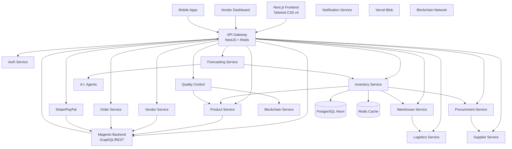
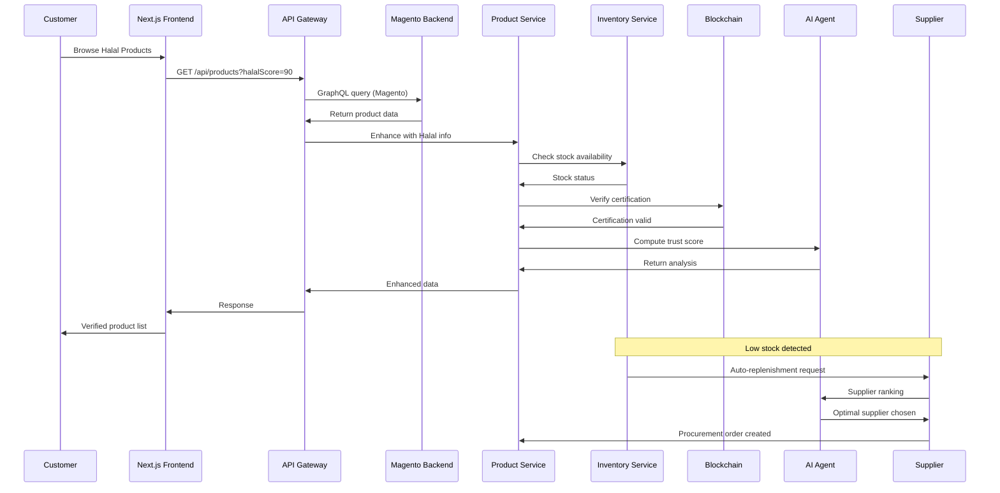
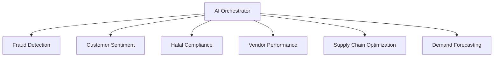

# HalalChain Multivendor E-commerce Platform 🕌

*A blockchain-powered, AI-driven multivendor e-commerce platform built for Halal products, ensuring end-to-end supply chain transparency and compliance.*


🔗 **Live Demo**: [demo.halal-chain.com](https://demo.halal-chain.com)
📖 **Documentation**: [docs.halal-chain.com](https://docs.halal-chain.com)

---

## 🌟 Key Features

### 🏪 Core E-commerce

* **Blockchain Verification** – Immutable Halal certification tracking
* **AI Multi-Agent System** – Automated vendor & product analysis
* **Multivendor Marketplace** – Vendor & catalog management
* **Real-time Analytics** – Business insights with live dashboards
* **Shariah Compliance** – Full halal monitoring & validation

### 📦 Supply Chain Intelligence

* **Automated Inventory** – Live stock optimization
* **Warehouse Management** – Multi-location smart storage
* **Logistics Integration** – Shipment tracking & delivery routing
* **Quality Control** – Blockchain-backed Halal compliance checks
* **AI Forecasting** – Demand prediction & stock replenishment
* **Procurement Automation** – Supplier selection & auto-ordering

### 🔧 Technical Foundation

* **Cloud-Native** – OCI-ready with auto-scaling
* **High Performance** – Redis caching + optimized queries
* **Enterprise Security** – JWT, RBAC & blockchain immutability
* **Magento Integration** – AliExpress product synchronization

---

## 🏗️ System Architecture



---

## 📊 Real-Time Data Flow



---

## 🚀 Quick Start

### Prerequisites

* Node.js **22.x+**
* PostgreSQL (Neon recommended)
* Redis **7.x+**
* Magento **2.4.x**
* Docker & Docker Compose

### Installation

```bash
git clone https://github.com/halalchain/halalchain-ecommerce.git
cd halalchain-ecommerce
npm install
cp .env.example .env
nano .env
```

### Database Setup

```bash
npx prisma generate
npx prisma db push
npm run db:seed
npm run sync:magento
```

### Development

```bash
npm run dev          # Full stack
npm run start:dev    # Backend only
npm run frontend:dev # Frontend only
npm test             # Unit tests
npm run test:e2e     # End-to-end tests
```

### Production

```bash
npm run build
npm run start:prod
docker-compose up -d
```

---

## 🧩 Project Structure

```
halalchain-ecommerce/
├── apps/
│   ├── frontend/        # Next.js app
│   └── backend/         # NestJS app
│       ├── src/
│       │   ├── auth/            # Authentication
│       │   ├── products/        # Product module
│       │   ├── vendors/         # Vendor management
│       │   ├── orders/          # Orders
│       │   ├── blockchain/      # Verification
│       │   ├── ai/              # AI agents
│       │   ├── supply-chain/    # Supply chain services
│       │   └── common/          # Shared utils
│       └── prisma/
│           └── schema.prisma
├── magento-integration/  # Magento module
├── docker-compose.yml
└── README.md
```

---

## 🔌 API Highlights

* **Auth**: `/auth/login`, `/auth/register`, `/auth/register/vendor`
* **Products**: `/products`, `/products/search`, `/products/:id`
* **Supply Chain**: `/inventory/products/:id/stock`, `/procurement/low-stock-alerts`
* **Vendors**: `/vendors/:id/dashboard`, `/vendors/:id/orders`

---

## 🤖 AI Agent System



---

## 🐳 Docker Deployment

```bash
docker-compose up -d
docker-compose logs -f api-gateway
docker-compose up -d --scale inventory-service=3
```

---

## 📈 Monitoring & Security

* Real-time vendor dashboards
* Inventory, logistics & AI metrics
* JWT + RBAC + Redis rate limiting
* Encrypted data & blockchain immutability

---

## 🤝 Contributing

1. Fork the repo
2. Create a feature branch (`git checkout -b feature/awesome`)
3. Commit (`git commit -m 'Add awesome feature'`)
4. Push (`git push origin feature/awesome`)
5. Open a Pull Request

---

## 📄 License

MIT License – see [LICENSE.md](LICENSE.md)

---

<div align="center">

**Built with ❤️ for the Global Muslim Community**

*Ensuring Halal integrity through technology and transparency*

[](https://star-history.com/#halalchain/halalchain-ecommerce&Date)

</div>  
