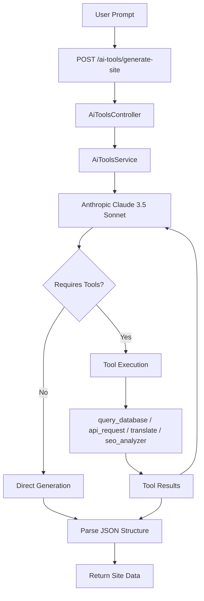
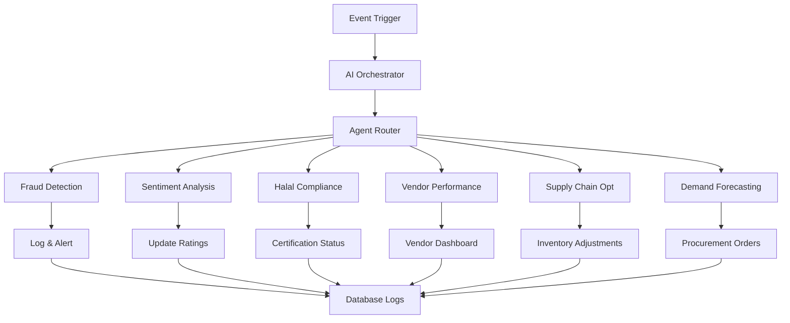

# HalalChain AI System Documentation

## Overview

The AI system in HalalChain leverages advanced language models and tool-calling capabilities to provide intelligent automation for e-commerce operations, particularly focused on Halal compliance, content generation, and business intelligence. Currently, it features a single-agent implementation using Anthropic's Claude 3.5 Sonnet model, with plans for expansion into a multi-agent architecture.

### Key Objectives
- **Halal Compliance**: Automated verification and analysis of product certifications
- **Content Generation**: AI-powered site and product description creation
- **Business Intelligence**: Sentiment analysis, fraud detection, and forecasting
- **Supply Chain Optimization**: Inventory prediction and supplier evaluation

## Current Implementation

### Core Components
- **AI Tools Module**: NestJS module handling AI requests (`apps/backend/src/modules/ai-tools/`)
  - **Controller**: `ai-tools.controller.ts` - Exposes `/ai-tools/generate-site` endpoint
  - **Service**: `ai-tools.service.ts` - Integrates with Anthropic SDK and tool handlers
  - **Dependencies**: `@anthropic-ai/sdk`, `@nestjs/axios`, Prisma for database access

### Site Generation Workflow
The primary AI workflow generates professional Halal business websites based on user prompts.

1. **User Input**: POST request to `/ai-tools/generate-site` with prompt (e.g., "Create a site for Halal food delivery")
2. **Model Invocation**: Claude 3.5 Sonnet processes the prompt, focusing on Halal-themed structure:
   - Homepage: Introduction and mission
   - Marketplace/Services: Certified products display
   - AI Assistant: Guidance for Halal queries
   - Certification Info: Verification resources
   - Contact: Partnership inquiries
3. **Tool Calling**: If needed, invokes tools for dynamic data:
   - Database queries for product info
   - API calls for external data
   - Translation for multilingual support
   - SEO analysis for optimization
4. **Response Parsing**: Returns structured JSON for site sections (hero, features, contact)

#### Workflow Diagram


### Available Tools
The service defines four tools for Claude to use:

1. **query_database**
   - **Description**: Executes safe SELECT queries on the PostgreSQL database
   - **Input**: `query` (SQL string), `params` (array of parameters)
   - **Safety**: Only SELECT queries allowed; uses Prisma `$queryRaw`
   - **Use Case**: Fetch products, vendors, or certifications dynamically

2. **api_request**
   - **Description**: Makes HTTP requests to external APIs
   - **Input**: `url`, `method` (GET/POST/etc.), `headers` (object), `body` (JSON string)
   - **Implementation**: Uses `@nestjs/axios` with error handling
   - **Use Case**: Integrate with payment gateways or external Halal databases

3. **translate**
   - **Description**: Translates text to target languages
   - **Input**: `text`, `target_lang` (e.g., "ar" for Arabic)
   - **Implementation**: LibreTranslate API (free, open-source)
   - **Use Case**: Multilingual site generation for global Halal markets

4. **seo_analyzer**
   - **Description**: Analyzes webpages for SEO best practices
   - **Input**: `url`
   - **Implementation**: Fetches HTML and extracts title, meta description, H1s, images
   - **Output**: Metrics and recommendations (e.g., "Add meta description")
   - **Use Case**: Optimize generated sites for search engines

### Fallback Mode
If `ANTHROPIC_API_KEY` is not set in `.env`, the service returns mock data:
```json
{
  "hero": "Welcome to Your Halal Business Site",
  "features": "Our Halal Products and Services",
  "contact": "Get In Touch"
}
```

## Setup and Configuration

### Prerequisites
- Node.js 22.x+
- Anthropic API Key (optional for mock mode)
- PostgreSQL database (via Neon or local)

### Environment Variables
Add to `.env`:
```
ANTHROPIC_API_KEY=your-anthropic-api-key
DATABASE_URL=your-postgresql-connection-string
```

### Installation
1. Install dependencies: `npm install`
2. Generate Prisma client: `npx prisma generate`
3. Set up database: `npx prisma db push`
4. Seed data: `npm run db:seed`
5. Start backend: `npm run backend:dev`

### Testing the AI Endpoint
```bash
curl -X POST http://localhost:3001/ai-tools/generate-site \
  -H "Content-Type: application/json" \
  -d '{"prompt": "Generate a Halal cosmetics website"}'
```

Expected Response (with API key):
```json
{
  "hero": "Pure Halal Beauty",
  "features": ["100% Certified Ingredients", "Shariah Compliant", "Global Shipping"],
  "marketplace": "Browse Our Collection",
  "certification": "Blockchain Verified",
  "contact": "info@halalbeauty.com"
}
```

## Planned Multi-Agent System

The database schema supports a full multi-agent architecture (`AIAgent` and `AIAgentLog` models). Future agents will include:

### Agent Types (Enum: AIAgentType)
- **FRAUD_DETECTION**: Monitors transactions and vendor behavior
- **SENTIMENT_ANALYSIS**: Analyzes customer reviews and feedback
- **HALAL_COMPLIANCE**: Verifies product certifications and supply chain
- **VENDOR_PERFORMANCE**: Evaluates vendor metrics and ratings
- **SUPPLY_CHAIN_OPTIMIZATION**: Optimizes inventory and logistics
- **DEMAND_FORECASTING**: Predicts sales trends using historical data

#### Planned Workflow


### Implementation Roadmap
1. **Agent Registry**: Create agents in DB with config JSON
2. **Orchestrator Service**: Route events to appropriate agents
3. **Tool Expansion**: Add blockchain interaction tools
4. **Logging & Monitoring**: Track agent performance and errors
5. **Integration**: Hook into order processing and inventory events

## Usage Examples

### Generate Halal Site
```typescript
// Frontend call
const response = await fetch('/api/ai/generate-site', {
  method: 'POST',
  body: JSON.stringify({ prompt: 'Halal restaurant website' }),
});
const siteData = await response.json();
```

### Extend with Custom Tools
Add new tools to `tools` array in `ai-tools.service.ts` and implement handler:
```typescript
{
  name: 'halal_verify',
  description: 'Verify product Halal status via blockchain',
  input_schema: { /* schema */ }
}
```

## Troubleshooting

- **API Key Error**: Ensure `ANTHROPIC_API_KEY` is set; fallback to mocks
- **Tool Failures**: Check network for API/translation calls; database for queries
- **Rate Limits**: Anthropic has usage limits; implement caching for repeated calls
- **Mock Mode**: Useful for development without costs

## Contributing to AI Features
- Add new tools for specific Halal workflows
- Implement multi-agent routing
- Enhance parsing for more site templates
- Integrate with frontend AI components

For more details, see the [main README](../README.md) and [Database Docs](README-DATABASE.md).
